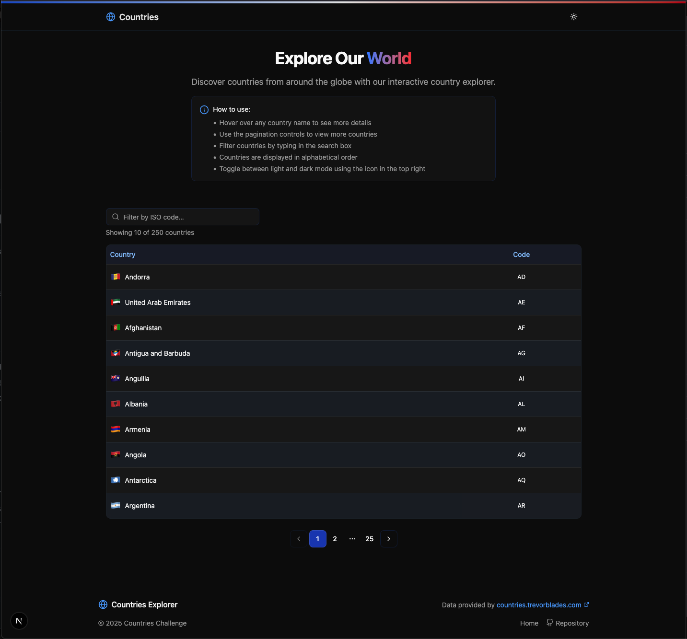

# Countries Challenge

## Personal Note

I developed this application with a focus on creating a solid foundation that could easily scale to a larger project. While the requirements were straightforward, I deliberately chose technologies and implemented a structure that would support future growth and complexity.

I selected Next.js, Apollo Client, and TypeScript as the core technologies because they provide excellent developer experience while maintaining high performance and type safety. The modular component design, dedicated GraphQL query files, and extensive test coverage demonstrate how even a seemingly simple application can be built with enterprise-grade practices.

The project structure separates concerns into distinct folders (components, providers, graphql, types), making it maintainable and extendable. My implementation choices, such as the tooltip functionality, theme toggling, and responsive design, to provide a bit more details and focus on user experience instead of just meeting basic requirements.

This application is more than just a coding challenge—it's a demonstration of how I approach software development with scalability and quality in mind from the start.

I hope you like it. Please feel free to provide some feedback.

Thanks.

Alain Mani

## Overview

This project consumes the GraphQL API available at https://countries.trevorblades.com/ to display the list of countries. Users can filter countries by code as required, also view detailed information with the tooltips, navigate through paginated results, and toggle between light and dark themes.

## Screenshots

<div align="center">
  
  <p><em>Main application view showing the countries list with filtering</em></p>
  
  
  <p><em>Tooltip showing detailed country information on hover</em></p>
  
  
  <p><em>Application in dark mode with filtered results</em></p>
</div>

## Features

- **Interactive Country Explorer**:

  - Displays countries with their flags, names, and ISO codes
  - Hover over countries to see additional details in tooltips
  - Filter countries by ISO code (case-insensitive)
  - Paginated results for better performance
  - Light/dark theme toggle

- **Responsive Design**:

  - Responsive design on mobile, tablet, and desktop screens

- **Developer Experience**:
  - Modular component architecture
  - Scalable GraphQL query structure
  - Comprehensive test coverage
  - TypeScript for type safety
  - Clean, maintainable code organization

## Technical Implementation

- Next.js for React framework
- Apollo Client for GraphQL data fetching
  - Scalable GraphQL queries structure in dedicated files
- TypeScript
- TailwindCSS and Shadcn for styling
- Jest and React Testing Library for tests

## Getting Started

### Prerequisites

- Node.js 18.0.0 or later
- npm or yarn

### Installation

1. Clone the repository

```bash
git clone https://github.com/requiemcreatif/Countries-challenge.git
cd countries-challenge
```

2. Install dependencies

```bash
npm install
# or
yarn install
```

3. Start the development server

```bash
npm run dev
# or
yarn dev
```

4. Open [http://localhost:3000](http://localhost:3000) with your browser to see the application

## Testing

The application includes comprehensive tests to ensure functionality works as expected. The tests covered are:

- Country data loading and display
- Filtering by country code (case insensitive)
- Proper pagination functionality
- Tooltip functionality
- Theme toggling
- Empty state handling

All tests are passing with 14 successful test cases covering essential features of the application.

If you need to run the tests:

```bash
npm test
```

To run tests in watch mode:

```bash
npm run test:watch
```

## GraphQL Query Used

```graphql
query Countries {
  countries {
    code
    name
    capital
    currency
    emoji
  }
}
```

# Countries-challenge
